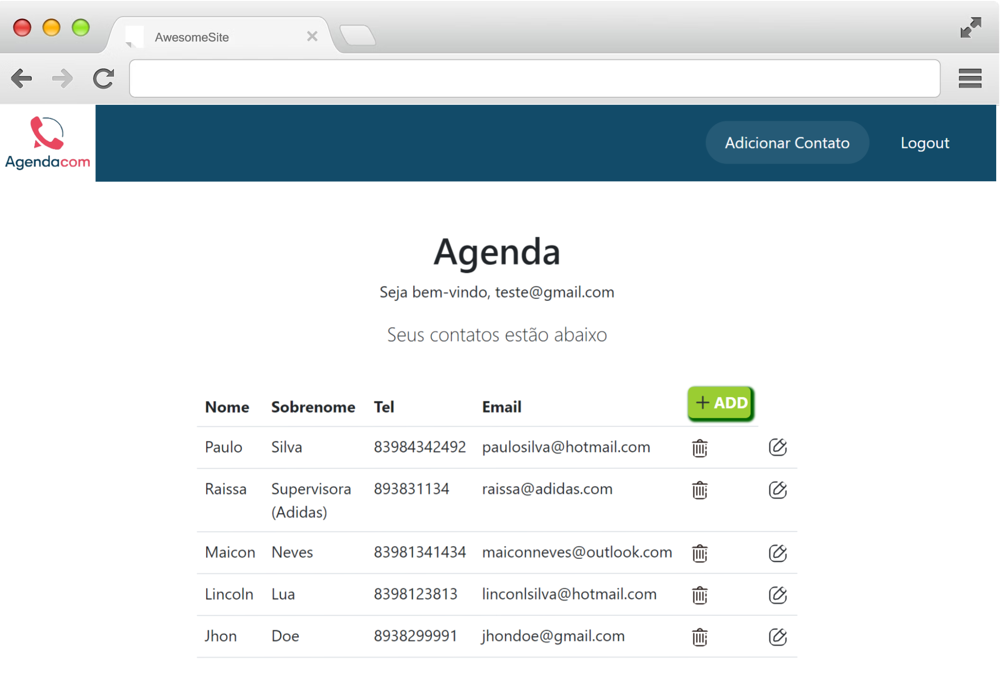

## Desafio - Aplicação AgendaCom
ㅤㅤㅤㅤㅤㅤ
ㅤㅤㅤㅤ
ㅤㅤ

## Tecnologias 

- [Node](https://nodejs.org/en)
- [Express](https://expressjs.com/pt-br/)
- [MongoDB](https://www.mongodb.com/)
- [Webpack](https://webpack.js.org/)
- [EJS](https://ejs.co/)
- [Bootstrap](https://getbootstrap.com/)

## **Organização de pastas do Projeto**

```
[AGENDA-MASTER]
├── frontend/
│   ├── assets/             # Arquivos estáticos para o frontend.
│   ├── main.js             # Arquivo JavaScript principal para o frontend.
│   └── node_modules/       # Diretório contendo dependências do projeto.
│
├── public/                 # Arquivos públicos acessíveis pelo cliente.
│
├── src/
│   ├── controllers/       
│   │   ├── contactController.js  # Controlador para lógica relacionada a contatos.
│   │   ├── homeController.js     # Controlador para lógica relacionada à página inicial.
│   │   └── loginController.js    # Controlador para lógica de login.
│   │
│   ├── middlewares/        
│   │   └── middleware.js   # Lógica de middleware.
│   │
│   ├── models/             # Diretório contendo os modelos de dados.
│   │   ├── ContactModel.js # Modelo de dados para contatos.
│   │   ├── HomeModel.js    # Modelo de dados para a página inicial.
│   │   └── LoginModel.js   # Modelo de dados para login.
│   │
│   └── views/              
│       ├── includes/       # Diretório contendo os templates das views.
│       │   ├── footer.ejs  # Template do rodapé.
│       │   ├── head.ejs    # Template do cabeçalho.
│       │   ├── messages.ejs# Template das mensagens.
│       │   └── nav.ejs     # Template da navegação.
│       │
│       ├── 404.ejs         # View da página de erro 404.
│       ├── contact.ejs     # View da página de contato.
│       ├── index.ejs       # View da página inicial.
│       ├── signIn.ejs      # View da página de login.
│       └── signUp.ejs      # View da página de cadastro.
│
├── .env                    # Arquivo de configuração de variáveis de ambiente.
├── .gitignore              # Arquivo de configuração do Git para ignorar arquivos e diretórios.
├── package-lock.json       # Arquivo de bloqueio de pacotes do NPM.
├── package.json            # Arquivo de configuração do NPM.
├── README.md               # Arquivo README do projeto (este arquivo).
├── routes.js               # Arquivo que define as rotas da aplicação.
├── server.js               # Ponto de entrada da aplicação, inicializa o servidor.
└── webpack.config.js       # Arquivo de configuração do Webpack.
```

## Como rodar
instale as dependencias com ```npm install``` <br>
crie um .env:
```env 
CONNECTIONSTRING=
# ex: CONNECTIONSTRING="mongodb://localhost:27017/meubancodedados"
```

Por fim, rode
```npm start``` para rodar o servidor na porta 3000. <br>
***


## Q.A

1. Porque eu decidi utilizar essas tecnologias como parte da solução

- Baseado nas orientações, utilizei Node e Express para o desenvolvimento de um back-end robusto. Para o banco de dados, optei pelo MongoDB, pois já possuo afinidade com ele e webpack para realizar o bundle dos arquivos. Essa abordagem me permitiu aplicar conhecimentos existentes enquanto aprendia novas tecnologias.

2. Qual foi a funcionalidade diferencial do seu projeto

- Além do que foi pedido no desafio, implementei um simples sistema de autenticação com cadastro e login de usuários, além de uma proteção de senhas com um sistema de criptografia de senhas utilizando o algoritmo hash, da biblioteca Bcryptjs.

3. O que eu faria a mais se tivesse mais tempo?

- Focaria nas boas práticas de programação do back-end, incluindo Clean Architecture, Design Patterns e S.O.L.I.D.
